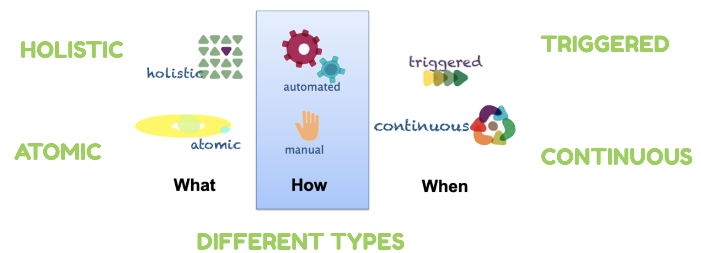
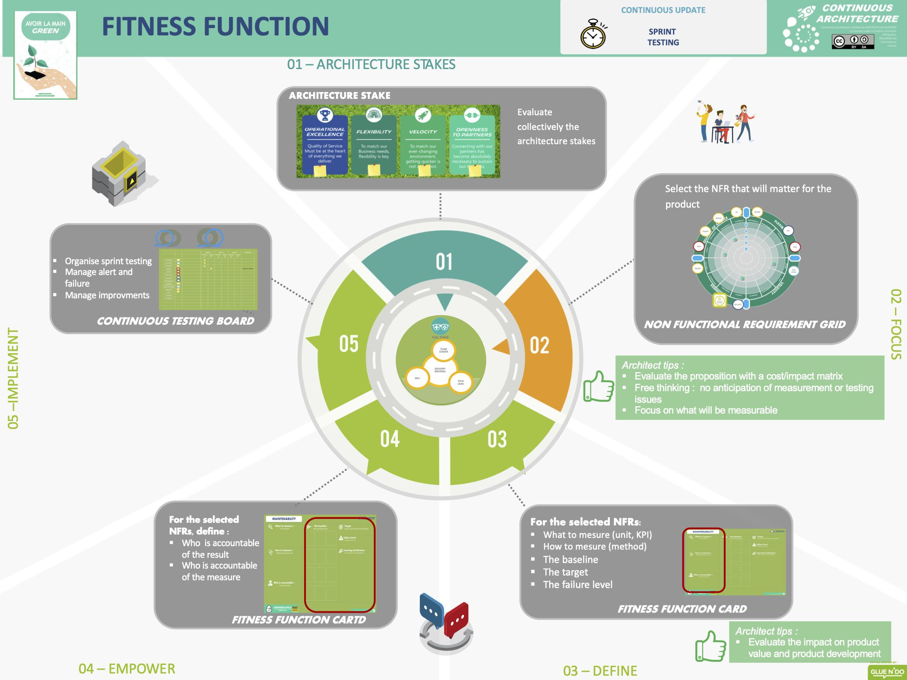

# Fitness Functions

---

## Introduction

Change is a constant in Software Architecture, and that is the reason why systems are so complex.
Business requirements change, technology changes, teams may change, and organization structure may also change. All of these changes need to align with the application objectives and architecture characteristics at certain moments in time. Therefore, we need to find a way to maintain the integrity of the application from all the architectural perspectives defined for the project.

Fitness Functions are mechanisms that help us preserve the application's health. Here, we are going to explain the different types of Fitness Functions and provide some examples of them.

---

## Origin of the name

- Originates from genetic algorithms designed to define success.
- Evolutionary computing includes various mechanisms that allow a solution to gradually emerge through small changes in each software version.

---

> “For example, when using a genetic algorithm to optimize wing design, the fitness function assess wind resistance, weight, air flow, and other characteristics desirable to good wing design. Architects define a fitness function to explain what better is and to help measure when the goal is met.”

[Ford, Parsons]

## Systemwide Fitness Functions

- It's a collection of fitness functions focused on one or more dimensions of the architecture.
- It's impossible to keep fitness functions for all architecture characteristics, so, we need to prioritize the FF in terms of the most important architecture characteristics.

---

## What Is a Fitness Function?

So, we can define a fitness function as:

> "Any mechanism that performs an objective integrity assessment of some architecture characteristic or combination of architecture characteristic."

[Ford, Richards]

---

### Any mechanism...

- Different tools are used to implement fitness functions:
    - Unit tests
    - Contract tests
    - Integration tests
    - Architecture metrics
    - Process metrics
    - Monitoring

---

### ...that performs an objective integrity assessment

- One key enabler for automated governance lies in objective definitions for architecture characteristics.
- Architects must address composite architecture characteristics. Those that aren't objectively measurable can be measured relative to other measurable aspects.
- Example: Agility can't be measured directly, but deployability, testability, and cycle time can.

---

### ...of some architecture characteristic or combination of architecture characteristic.

- This characteristic describes two scopes for fitness functions: Atomic and Holistic

---

## Categories

### Atomic vs Holistic

#### Atomic

- Runs against a singular context and assesses one particular aspect of the architecture.
- Example: Using unit tests to verify architectural characteristics like modular coupling.

---

### Atomic vs Holistic

#### Holistic

- Used when measuring multiple architecture characteristics. Holistic fitness functions assess a combination of architectural aspects within a shared context.
- Example: Evaluating security and scalability.

---

For example, consider an architecture with fitness functions for both security and scalability. In the case of the security fitness function, it checks whether the data is outdated, a critical aspect. Scalability tests focus on concurrent users within specific response time ranges.

To achieve scalability, developers implement caching, allowing the atomic scalability fitness function to pass. When caching is turned off, the security fitness function still succeeds. However, when evaluated together, enabling caching causes the data to become too outdated to pass the security fitness function, leading to the failure of the holistic test.

[Ford, Parsons]

---

- It's impossible to cover all possible combinations, so prioritizing architecture characteristics is necessary.

---

### Triggered vs Continual

#### Triggered

- Runs based on a specific event, such as executing a unit test or performing exploratory testing by a QA person.

---

### Triggered vs Continual

#### Continual

- Executed continuously to verify architectural aspects, such as transaction speed, for instance, executing a unit test or a QA person performing exploratory testing.

---

### Static vs Dynamic

#### Static

- Static fitness functions produce fixed results, like a binary pass/fail of a unit test.
- Used for metrics, e.g., defining acceptable ranges for average cyclomatic complexity of methods in the codebase.

---

### Static vs Dynamic

#### Dynamic

- Metrics values may vary depending on circumstances.
- Example: A performance metric may vary depending on scalability.

---

### Automated vs Manual

### Automated

- Developers often automate most fitness functions, e.g., CI/CD for testing.

---

### Automated vs Manual

### Manual

- In some cases, it's not possible to create automated fitness functions due to the nature of the process. For example, manual QA may be necessary for a project, and the PM wants to retain them for a period.

---

> https://continuous-architecture.org

---

### Temporal

- Architects may want to introduce a time component into fitness assessments.
- Example: Adding a reminder (warning) when a feature flag is added.

---

### Intentional over Emergent

- Most fitness functions are defined to elucidate architectural characteristics. Some emerge during system development (the 'unknown unknowns' problem).

---

### Domain Specific

- Some architectures have specific domain-oriented requirements.
- Example: A company handling international fund transfers might design a specific, continuous, holistic fitness function that stress-tests security.

---

## When to Define Fitness Functions

- Fitness functions must be identified as part of the initial overall architecture concerns.
- System fitness functions must also be identified to determine the type of change they want to support.

---

### What Happens If I Don't Identify My Fitness Functions Early?

- Making incorrect design choices that ultimately lead to software failure in its environment.
- Making design choices that consume unnecessary time and/or resources.
- Difficulty evolving the system in the future when the environment changes.

---

## How to Define it

### What?

- Pick and choose the architecture characteristics depending on the product

### How?

- Define how to measure them. Define the baseline, the target and the failure threshold.

### When?

- When to measure? Continuously or triggered

---

> https://continuous-architecture.org
---

## Fitness Function Classification

---

### Key

- These factors are essential when making technology or design decisions. It's important to invest more effort in exploring design options that make changes in these areas much easier.
- Examples:
    - Usability for a Social Network App: When designing a social network app, ensuring a highly usable user interface and experience is crucial. Easy navigation, intuitive design, and user-friendly features are key factors influencing the app's success.
    - Security in an App Handling Payments: In an application dealing with financial transactions, security is paramount. Implementing strong encryption, authentication mechanisms, and protection against fraud is essential to safeguard sensitive user data.

---

### Key

- Scalability in a Cloud-Based Service: For a cloud-based service, the ability to dynamically scale to handle varying loads is critical. A fitness function measuring scalability ensures the architecture supports rapid growth in users and demand.
- Data Integrity in a Healthcare Application: In a healthcare application storing patient records, data integrity is crucial. Ensuring accurate and secure patient data is essential for regulatory compliance and patient safety.

---

### Relevant

- These factors should be considered when working on individual features but play a less significant role in architectural decisions. For instance, while code quality metrics are important, they are not the most crucial factors.
- Examples:
    - Code Quality Metrics: Code quality is important, but it falls under the "Relevant" category in architectural decisions. Metrics like code complexity or maintainability are relevant for features and modules but may not heavily impact high-level architecture choices.
    - Test Coverage Metrics: Test coverage metrics matter for feature development but may not significantly influence architectural decisions. They measure how much of the codebase is covered by automated tests, critical for feature reliability.
    - Code Duplication Metrics: Detecting and reducing code duplication is relevant for maintainability but not a primary factor in high-level architectural choices.

---

### Not Relevant

- Design and technology choices are not influenced by these aspects.
- Examples:
    - Cycle Time Metrics: Metrics related to the time from design to implementation may be important for process optimization but are typically not relevant to architectural decisions. Architecture focuses on the system's structure and functionality.
    - Electricity Consumption Metrics for a Mobile App: Metrics related to the app's electricity consumption, while important for device battery life, are typically not relevant to architectural decisions. Architecture concerns higher-level aspects.
    - Printer Speed Metrics for a Cloud-Based Document Storage Service: Printer speed used by clients is not typically relevant to architectural decisions for a cloud-based document storage service. Architecture focuses on data storage, retrieval, and security at a higher level.

---

## Fitness Function Examples

Paul & Wang defined a series of examples taking some priorities and linked them withe some architectural characteristics

### Code Quality

#### What?: Architecture characteristics

- Modifiability, Manageability, Adaptability

#### How?

- Identify aspects to measure code quality:
    - Test coverage: 90%
    - [Maintainability Rating](https://sourcery.ai/blog/maintainability-index/#:~:text=Whether%20it's%20looking%20at%20a,maintainability%20follow%20a%20power%20law.): > 10%

#### When?

- Automated: Add it as part of the CI/CD

---

### Resiliency

- A test could run a continuous load against a service while a new version of that service is rolled out to a pre-production environment.

#### What?

- Stability, Resiliency and Availability

#### How?

- Running a test continuously while a new version is rolled-out to a pre-production environment.
- Metrics:
    - New Deployment: Error Rate < 1%
    - Network Latency: Error Rate < 5% & Transaction Time < 10s

#### When?

- Automated: Add it as part of the CI/CD

---

### Observability

To ensure that applications are monitored

#### What?

- Debuggability, Auditability

#### How?

- Ensure logs and metrics are produced correctly
- Ensure application have a health endpoint
- Ensure a correlation or track id is logged
- Metrics:
    - Are metrics enabled: check for all defined metrics: DB, API etc
    - Has parseable logs: Logs Contain necessary information

#### When?

- Automated: Add it as part of the CI/CD

---

### Performance

#### What?

- Scalability, Stability

#### How?

- Writing automated performance tests and implementing those tests as fitness functions.
- Metrics: Transaction Round trip time < 10s & Error rate < 1%

#### When?

- Automated: Add it as part of the CI/CD

---

### Compliance

#### What?

- Auditability

#### How?

- Metrics: Adding some validations
    - Logs should not have PII information
    - Last audited date < 365D

#### When?

- Automated: Add it as part of the CI/CD

---

### Security

#### What?

- Security

#### How?

- Implement OWASP Validation
- No secrets in code
- Should not use libraries with known vulnerabilities
- Should not use containers with known vulnerabilities

#### When?

- Automated: Add it as part of the CI/CD

---

### Operability

#### What?

- Manageability, Operability and Recoverability

#### How?

- Apply checks on documentation
    - Should have a service runbook
    - Should have a readme file
    - Should have alerts
    - Should have tracing IDs

#### When?

- Automated: Add it as part of the CI/CD
- Manual

### References

- Ford, N., Richards, M., Pramod Sadalage, & Dehghani, Z. (2021). Software Architecture: The Hard Parts. _O’Reilly
  Media, Inc._
- Ford, N., Parsons, R. & Kua P. (2017). Building Evolutionary Architectures. _O’Reilly Media, Inc._
- Paul, P. & Wang, R. Fitness function-driven development. (2019). Thoughtworks. Retrieved October 17, 2023, from https://www.thoughtworks.com/insights/articles/fitness-function-driven-development
- Continuous architecture. (n.d.). Continuous-architecture.org. Retrieved October 17, 2023, from https://continuous-architecture.org/docs/practices/fitness-functions.html

